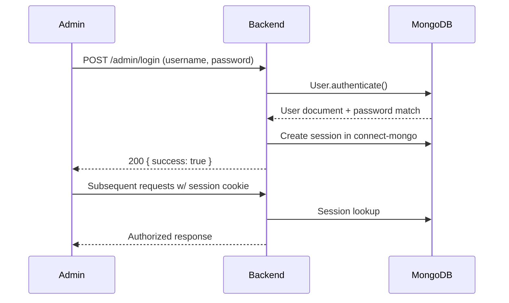
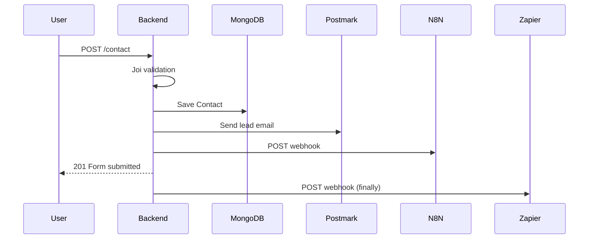
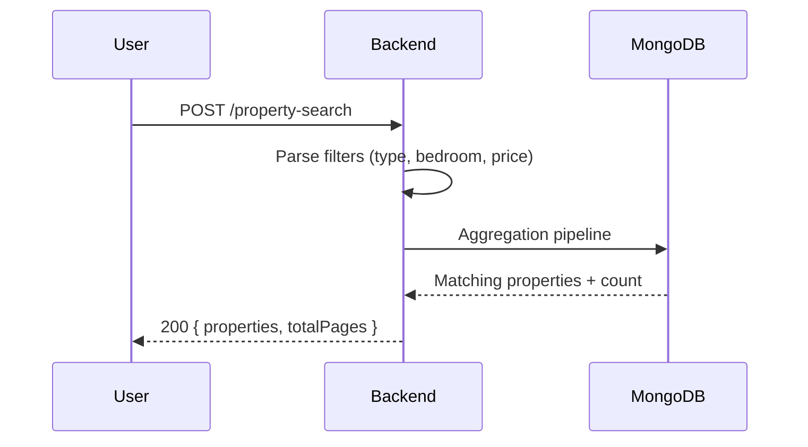
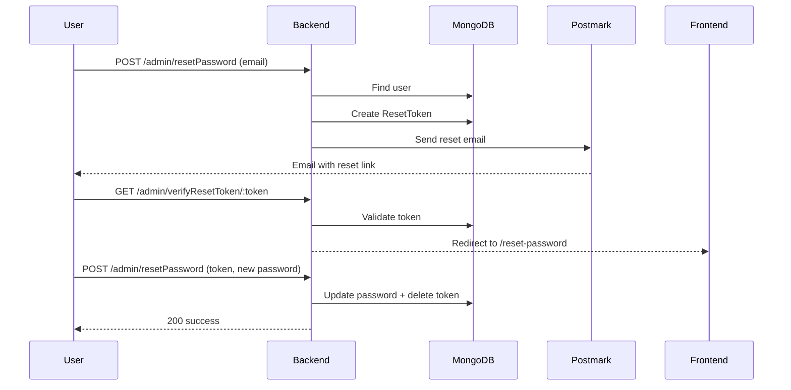

# System Flows (Sequence Diagrams)

Below are high-level sequence diagrams for core flows.

## 1. Admin Login + Session

## 2. Contact Form Submission

## 3. Property Search

## 4. Password Reset

